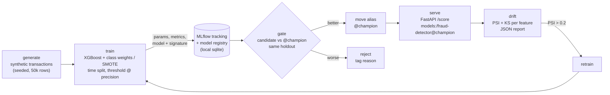

# fraud-mlops-pipeline

[](https://github.com/veeranjanreddy-86/fraud-mlops-pipeline/actions/workflows/ci.yml)


Card-fraud detection with MLflow-governed training, champion/challenger promotion gates,
FastAPI serving and PSI/KS drift monitoring.

> Representative portfolio project built on synthetic data; not affiliated with or derived from
> any employer's code or data.

## Business problem

Card issuers trade off two costs. **Missed fraud** turns into chargebacks, write-offs and
operations work. **False declines** block genuine customers at checkout, which brings support
calls, abandoned baskets and lost cardholders. Fraud is rare (about 1-2% of transactions here),
so accuracy is a meaningless metric: a model that approves everything is 98.6% "accurate".
This project therefore:

- optimises and gates on **PR-AUC** and **recall at a fixed precision**, not accuracy or ROC-AUC;
- picks the decision threshold to hit a **precision target** (which caps false declines per true
  catch), with an optional **cost-based** threshold (`FN cost` vs `FP cost`);
- only lets a new model replace production when it beats the current champion on the same
  recent holdout window.

## Architecture



| Module | Responsibility |
| --- | --- |
| `data.py` | Deterministic generator: amount, merchant category, hour, device/geo mismatch, 1h/24h velocity, account age. Fraud labels come from a latent logistic model plus unobserved noise; the intercept is solved to hit the target fraud rate. |
| `features.py` | Stateless derived features (log amount, cyclical hour, night flag, velocity ratio, new-account flag) followed by a `ColumnTransformer` (scaling, passthrough, one-hot with `handle_unknown="ignore"`). |
| `train.py` | Chronological train/valid/test split, XGBoost with `scale_pos_weight` (optional SMOTE through `imblearn`), threshold selection, MLflow logging (params, metrics, confusion matrix, model and signature) and registration. |
| `gate.py` | Scores the candidate and the `@champion` on the same newest holdout, checks absolute floors and non-regression, then moves the alias (keeping `@previous_champion` for rollback) or rejects with tagged reasons. |
| `serve.py` | FastAPI `POST /score`, `POST /score/batch`, `GET /health`. Strict pydantic validation, JSON logs, request IDs and latency headers. |
| `drift.py` | PSI (quantile bins from the reference data, category frequencies for discrete features) and two-sample KS per feature. Writes a JSON report and flags a retrain when any PSI > 0.2. |
| `cli.py` | `fraud-mlops generate / train / gate / drift / export / serve`. |

## Quickstart

```bash
make install          # .venv + pinned deps + editable package (Python 3.11+)
make lint test        # ruff + pytest
make pipeline         # generate -> train -> gate -> train (SMOTE) -> gate -> drift
make serve            # serves models:/fraud-detector@champion on 127.0.0.1:8000
mlflow ui --backend-store-uri sqlite:///mlruns/mlflow.db   # browse runs and registry
```

You can also call the steps one at a time:

```bash
fraud-mlops generate --rows 50000 --fraud-rate 0.015 --seed 42
fraud-mlops train --threshold-method precision      # or: cost, --smote
fraud-mlops gate --strict                           # exits 1 if the candidate is rejected
fraud-mlops generate --rows 10000 --seed 202 --start 2025-04-01 --drift 1.0 --out data/current.parquet
fraud-mlops drift --fail-on-drift                   # exits 2 if a retrain is recommended
```

Container (self-contained: the build stage trains, gates and exports the champion; the runtime
stage runs as a non-root user):

```bash
docker build -t fraud-mlops . && docker run -p 8000:8000 fraud-mlops
```

### Example request / response

```bash
curl -s -X POST localhost:8000/score -H 'content-type: application/json' -d '{
  "transaction_id": "txn_demo_001", "amount": 849.0, "merchant_category": "electronics",
  "hour": 2, "device_mismatch": true, "geo_mismatch": true,
  "txn_count_1h": 5, "txn_count_24h": 7, "account_age_days": 12 }'
```

```json
{
  "transaction_id": "txn_demo_001",
  "fraud_probability": 0.999188,
  "decision": "decline",
  "threshold": 0.896401,
  "model_version": "2",
  "latency_ms": 57.484
}
```

`POST /score/batch` takes `{"transactions": [...]}` (1 to 1000 items) and returns one score per
item plus `model_version` and `latency_ms`. Invalid input (negative amount, unknown category,
`txn_count_24h < txn_count_1h`, unexpected fields) returns `422`.

## Results (local run)

These numbers come from `make pipeline` on the default 50k-row dataset (1.42% fraud). The
holdout test set is the newest 15% of transactions (7,500 rows, 104 fraud), which the model
never saw during training or threshold selection. The precision target is 0.80.

| Version | Variant | ROC-AUC | PR-AUC | Recall@P80 | Threshold | Precision | Recall | Alert rate | Gate |
| --- | --- | --- | --- | --- | --- | --- | --- | --- | --- |
| v1 | XGBoost + `scale_pos_weight`, precision threshold | 0.954 | 0.526 | 0.327 | 0.963 | 0.745 | 0.337 | 0.63% | promoted (first champion) |
| v2 | + SMOTE (10% minority ratio) | 0.958 | **0.544** | **0.365** | 0.896 | 0.809 | 0.365 | 0.63% | **promoted** (beat v1 on both) |
| v3 | class weights, cost threshold (FN=250, FP=10), seed 7 | 0.954 | 0.519 | 0.317 | 0.283 | 0.120 | 0.846 | 9.80% | rejected (regressed on both) |

The cost-optimal threshold (v3) shows the trade-off directly. When a missed fraud costs 25 times
a false decline, the cheapest policy flags about 10% of traffic, catching 85% of fraud at 12%
precision. That suits a step-up or review queue, but it is far too aggressive for hard declines.

Serving latency, measured in-process over 300 warm requests on a 2-vCPU sandbox: single-row
`/score` p50 14.4 ms, p95 18.0 ms. A 100-row batch takes about 19 ms p50.

## Design decisions

- **Time-based split, not random.** Oldest 70% for training, the next 15% for threshold tuning,
  newest 15% for the holdout. A random split leaks future patterns into training and overstates
  how well a model will score tomorrow's traffic.
- **Threshold by precision target.** The threshold is the lowest score that reaches the target
  precision on the validation window, which gives the most recall the false-decline budget
  allows. It is chosen on validation and reported on test, so the reported operating point is
  not tuned on the data that measures it. The threshold is stored as a model-version tag and
  travels with the model.
- **Gate on threshold-free metrics, on the same data.** The gate scores both candidate and
  champion on the identical newest window and compares PR-AUC and recall@precision. A candidate
  must clear absolute floors, must not regress on either metric, and must beat the champion's
  PR-AUC by at least `GATE_MIN_IMPROVEMENT`.
- **Alias-based promotion.** Serving resolves `models:/fraud-detector@champion`, so promoting or
  rolling back only moves an alias. No redeploy is needed. The previous champion keeps
  `@previous_champion`, and each version is tagged with `gate_status`, `gate_reason` and its gate
  metrics for auditability.
- **Imbalance handling.** `scale_pos_weight = neg/pos` is the default. SMOTE is optional and runs
  inside the `imblearn` pipeline, so it only touches training folds and is a no-op at inference.
- **Safe model loading.** MLflow 3 serialises with `skops`, and only explicitly allow-listed
  types are trusted at load time.

## Monitoring

`fraud-mlops drift` compares a reference sample (training data) with a current batch.

- **PSI** per feature, with quantile bins learned on the reference data and category frequencies
  for discrete features. Bands: < 0.1 stable, 0.1-0.2 moderate, > 0.2 significant.
- **KS** two-sample statistic and p-value for numeric features.
- Writes a JSON report (`reports/drift_report.json`) with `retrain_recommended` and
  `drifted_features`. `--fail-on-drift` makes it usable as a scheduled CI/CD check.

Local run, 50k reference vs two 10k "April" batches:

| Feature | PSI, same-distribution batch | PSI, shifted batch (`--drift 1.0`) | Status (shifted) |
| --- | --- | --- | --- |
| amount | 0.0009 | 0.2134 (KS 0.189) | significant |
| merchant_category | 0.0003 | 0.2274 | significant |
| device_mismatch | 0.0000 | 0.1313 | moderate |
| geo_mismatch | 0.0003 | 0.0131 | stable |
| hour, velocity, account age | < 0.004 | < 0.004 | stable |
| **retrain_recommended** | false | **true** | |

On the shifted batch the champion's ranking still holds (PR-AUC 0.60 to 0.62), but the
operating point moves. Precision at the frozen threshold falls from 0.91 to 0.62 and the alert
rate more than doubles (0.65% to 1.45%). Watching drift and the alert rate catches this before
labels arrive, and labels in fraud often lag by weeks.

## Limitations

- **Synthetic data.** The fraud mechanism is a known logistic model, so the absolute metrics
  only show that the pipeline works and how components compare. They are not a benchmark. Real
  fraud is adversarial, its labels are delayed and noisy, and it is far more heterogeneous.
- **Small positive count in the holdout** (104 fraud). Differences of about 0.02 PR-AUC are
  within sampling noise. In production, set `GATE_MIN_IMPROVEMENT` above zero and/or use a
  bootstrap confidence interval.
- **Scores are not calibrated probabilities.** Class weighting and SMOTE inflate scores, which is
  why the thresholds sit high. Add isotonic or Platt calibration if downstream consumers need
  true probabilities.
- **No feature store.** Velocity features arrive precomputed in the request. Real systems need
  point-in-time-correct online/offline features to avoid training/serving skew.
- **Local MLflow only.** The registry is a local sqlite store, with no auth or multi-user access.
- The API has no authentication or rate limiting. Put it behind a gateway.

## Roadmap

- MLflow on Databricks, or a managed tracking server, with Unity Catalog model registry.
- Deployment to SageMaker endpoints or AKS (Helm chart, HPA, canary on alias change).
- SHAP reason codes in the `/score` response for analyst review and adverse-action notices.
- A feature store (Feast/Databricks) for point-in-time velocity and account features.
- Delayed-label performance monitoring, a calibration layer, and a scheduled drift job that
  triggers retraining automatically.

## Project layout

```
src/fraud_mlops/   data, features, metrics, train, registry, gate, serve, drift, cli, config
tests/             data, features, metrics, train, gate, API and drift tests (pytest)
Dockerfile         multi-stage, non-root runtime serving the exported champion
.github/workflows  ruff + pytest + pipeline smoke on Python 3.11 / 3.12
```

## License

[MIT](LICENSE) © 2026 Veeranjan Reddy
